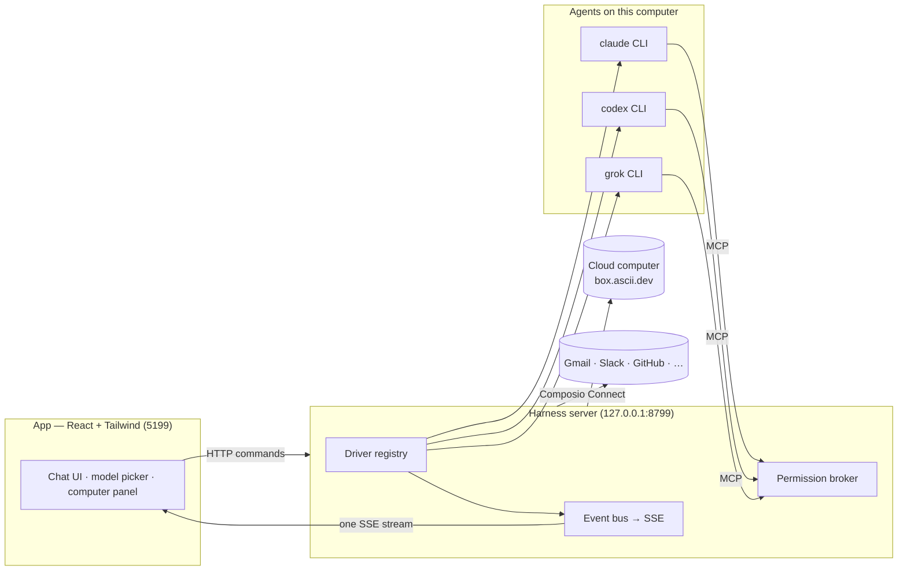

> ⚠️ **No affiliation with any cryptocurrency.** VelarixBot has no token. Any coin using the VelarixBot, Maus, or SupaMaus name is not created, endorsed, or affiliated with this project or its maintainer. I have received no tokens, payment, or allocation from anyone, and I will not be endorsing any token.

<div align="center">

# VelarixBot

**Your own team of AI bots, in a chat app.**

<sub>A private, local-first take on **Grok Bot**, using the agent subscriptions you already have.</sub>

Every bot in the sidebar is a real agent. Claude, Codex, or Grok runs locally under the hood with its own
personality, model, conversation, and connected apps. Bots can share one persistent Box cloud computer.
Talk to them like contacts. Watch them work. Approve what matters.


<br>

<a href="https://github.com/Velarixx/VelarixBot/releases">
  
</a>

<sub>Private internal releases built by GitHub Actions · macOS DMG + Windows installer · [installation and trust instructions](INTERNAL_INSTALL.md)</sub>

<br>
<br>


</div>

---

## Why

One assistant in one box is the wrong shape for agents. VelarixBot applies the **Grok Bot** messaging model
to a private team setup: a roster of bots with separate personalities, conversations, models, and apps,
backed by local agent CLIs and an optional shared cloud computer.

- **Bring your own agents.** Bots run directly on the `claude`, `codex`, and `grok` CLIs installed on your computer. They use your
  existing CLI login or OAuth session and subscription, no VelarixBot account and no model proxy in the middle.
- **Local first.** One small harness server on `127.0.0.1` owns every agent process. Transcripts, keys, and
  events live in `~/.velarixbot`, not a cloud.
- **Explicit routing.** You choose the provider and model for each bot. If that engine is unavailable, the bot
  reports a blocked state; VelarixBot does not silently fail over to another provider or model.
- **Agents with hands.** Bots can use one shared persistent Box cloud computer, visible while they work. On
  macOS, a bot can instead use the local Mac after explicit approval. Composio Connect adds optional app integrations.

## Features

<table>
<tr>
<td width="50%" valign="top">

### 🧠 Pick a brain per bot

A model picker with a provider rail — Claude and Codex models side by side, defaults marked, unavailable
providers dimmed with the reason. Switch a bot's model mid-conversation.


</td>
<td width="50%" valign="top">

### 🖥️ One shared cloud computer

Open the Computer panel to connect a bot to the team's persistent Box cloud desktop. You can watch it work
or open the desktop in your browser. On macOS, you can explicitly switch a bot to *this Mac* instead.


</td>
</tr>
<tr>
<td width="50%" valign="top">

### 🙋 Bots ask before they act

Shell commands, file edits, and questions surface as inline cards — Allow / Deny / answer in chat. A
permission broker turns every risky action into a decision you make, for cloud and local computers alike.


</td>
<td width="50%" valign="top">

### 🔌 Connected apps

A one-click marketplace over Composio Connect: Gmail, Slack, GitHub, Notion, Linear and hundreds more.
OAuth once, and every bot can use them as tools.


</td>
</tr>
<tr>
<td width="50%" valign="top">

### 🗂 Manage bots like chats

Right-click any bot: pin, mark unread, edit profile, duplicate, copy conversation ID, hide, delete. It's a
messaging app — your agents behave like contacts.


</td>
<td width="50%" valign="top">

### 🔑 Keys once, everything lights up

Paste credentials in App Settings — they persist locally and the provider fleet hot-reloads instantly.
Secrets are write-only: the UI only ever sees "configured" flags.


</td>
</tr>
</table>

**Also in the box:** streaming replies with tool-run activity chips · native macOS dictation from the
composer mic (on-device Apple speech recognition — desktop app) · SupaMaus cursor mascots with role-aware
expressions · screenshots of the bot's work folded into the transcript · persistent scheduled routines.

### Bot states, usage, and routines

Every bot shows an explicit runtime state: **Idle**, **Running**, **Done**, **Blocked**, or **Needs input**.
State details explain blocked or interrupted turns. The sidebar and chat header also show compact provider-reported
input/output token totals and cost when the provider supplies it; unknown cost is shown as unavailable, never guessed.

Open **Routines** from the sidebar to create a persistent scheduled prompt for a bot, enable or pause it, inspect its
next/last run, or delete it. Routines are stored locally and run while the harness server is running. A busy bot will
not start overlapping routine work.

## How it works

Two processes. The app holds no transports of its own — it sends typed commands over HTTP and folds one SSE
event stream into state. The harness server owns every agent process and normalizes each provider's native
protocol into one canonical runtime event stream (logged per-thread as NDJSON).



| Layer | Where | What it does |
|---|---|---|
| Drivers | `server/drivers/` | One per provider: Claude, Codex, and Grok Build over their local CLIs (stream-JSON / JSON-RPC / ACP), plus a cloud-computer agent. Unknown drivers degrade to "unavailable", never crash the fleet. |
| Harness | `server/harness/` | Registry (configs → live instances) and the fan-in event bus every client folds. |
| API | `server/index.ts` | Bots, turns, approvals, model catalog, computer lifecycle, connectors, config — HTTP + SSE. |
| App | `src/` | The chat shell. Server-backed store, one reducer, zero client-side transports. |
| Desktop | `electron/` | macOS and Windows shell; dictation and local CUA are macOS-only in the first Windows release. |

## Quick start

**Easiest:** invited team members download the macOS `.dmg` or Windows `.exe` from
[private GitHub Releases](https://github.com/Velarixx/VelarixBot/releases) and follow
[the one-time trust instructions](INTERNAL_INSTALL.md). The harness server is embedded — no Node, pnpm, or source checkout.

**From source:**

```sh
git clone https://github.com/Velarixx/VelarixBot && cd VelarixBot
pnpm install

pnpm dev:server    # harness server → 127.0.0.1:8799
pnpm dev           # app → http://127.0.0.1:5199
pnpm dev:desktop   # or the Electron shell
```

Source-development requirements: **macOS or Windows**, **Node 24+**, **pnpm**, and at least one agent CLI: [`claude`](https://claude.com/claude-code),
[`codex`](https://github.com/openai/codex), or [`grok`](https://x.ai/cli) — installed and logged in. They appear
in the model picker automatically.

Optional, pasted once in **App Settings** (gear in the sidebar footer):

| Key | Unlocks |
|---|---|
| Composio Connect key (`ck_…`) | The connected-apps marketplace |
| Composio API key (`ak_…`) | The full 500+ app catalog with official logos |
| Box token ([box.ascii.dev](https://box.ascii.dev)) | The shared cloud computer |

## Privacy and data storage

VelarixBot includes **no product analytics or telemetry** and does not ask for or collect your name or email.
First-run completion is only a local browser-profile flag. Engine detection is local, and microphone permission is
optional and requested only for on-device dictation.

Bot definitions, transcripts, routines, configuration, and credentials are stored under `~/.velarixbot`. Desktop-only
runtime files use Electron's OS-specific VelarixBot user-data directory. This is local-first, not per-user encryption:
anyone who can use the same OS account or read those directories can access the data. On a shared computer, use a
separate OS account and do not configure credentials you are unwilling to share.
Provider prompts still go directly to the explicitly selected CLI/provider under that provider's own privacy terms.

## Internal desktop releases

GitHub Actions builds the distributable installers on native runners: separate Intel and Apple Silicon macOS DMGs,
plus a Windows x64 NSIS installer. These internal builds intentionally use the free manual-trust route. The macOS app
is ad-hoc signed but not notarized, and the Windows installer is unsigned. Follow [`INTERNAL_INSTALL.md`](INTERNAL_INSTALL.md)
to verify `SHA256SUMS.txt` and approve only the downloaded VelarixBot copy.

Automatic updates are disabled because Releases are private and VelarixBot does not embed a reusable GitHub token.
Download each update manually from [private GitHub Releases](https://github.com/Velarixx/VelarixBot/releases), verify its
checksum, and install it over the existing version.

```sh
pnpm typecheck     # app + server
pnpm build         # typecheck + production build
```

## Status

The main loop works end to end: message → explicitly selected agent/model → streamed reply → tools → approvals →
computer use, with persistent scheduled routines and visible runtime/usage state. GitHub Actions builds internal macOS
and Windows release candidates. Native dictation and local-computer control are unavailable in the first Windows release;
chat, routines, provider CLIs, and the shared Box cloud computer remain available.

The driver SPI in [`server/contracts.ts`](server/contracts.ts) is small. Adding a provider requires one driver in
[`server/drivers/`](server/drivers/) plus registration in the built-in provider list.

## License

[MIT](LICENSE) © 2026 Milind Soni and contributors.

VelarixBot is an independent, privately distributed project inspired by Grok Bot. Its source remains MIT licensed. It is
not affiliated with, endorsed by, or associated with xAI; "Grok" is a trademark
of its respective owner.
