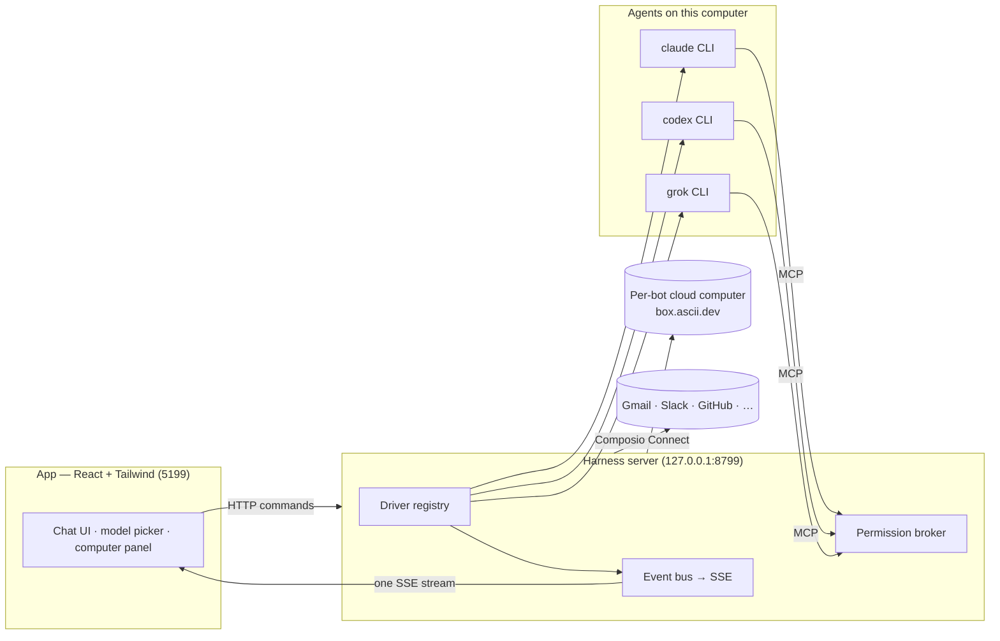

<div align="center">

# VelarixBot

**Your own team of AI bots, in a chat app.**

<sub>A private, local-first take on **Grok Bot**, using the agent subscriptions you already have.</sub>

Every bot in the sidebar is a real agent. Claude, Codex, or Grok runs locally under the hood with its own
personality, model, conversation, and connected apps. Each bot can have its own persistent Box cloud computer.
Talk to them like contacts. Watch them work. Approve what matters.


<br>

<a href="https://github.com/Velarixx/VelarixBot/releases">
  
</a>

<sub>Private internal releases built by GitHub Actions · macOS DMG + Windows installer · [installation and trust instructions](INTERNAL_INSTALL.md)</sub>

<br>
<br>


</div>

---

## Why

One assistant in one box is the wrong shape for agents. VelarixBot applies the **Grok Bot** messaging model
to a private team setup: a roster of bots with separate personalities, conversations, models, and apps,
backed by local agent CLIs and optional per-bot cloud computers.

- **Bring your own agents.** Bots run directly on the `claude`, `codex`, and `grok` CLIs installed on your computer. They use your
  existing CLI login or OAuth session and subscription, no VelarixBot account and no model proxy in the middle.
- **Local first.** One small harness server on `127.0.0.1` owns every agent process. Transcripts, keys, and
  events live in `~/.velarixbot`, not a cloud.
- **Explicit routing.** You choose the provider and model for each bot. If that engine is unavailable, the bot
  reports a blocked state; VelarixBot does not silently fail over to another provider or model.
- **Agents with hands.** Each bot can use its own persistent Box cloud computer, visible while it works — two
  cloud bots can run at once. On macOS, a bot can instead use the local Mac after explicit approval. Composio
  Connect adds optional app integrations, mounted per bot.

## Features

<table>
<tr>
<td width="50%" valign="top">

### 🧠 Pick a brain per bot

A model picker with a provider rail — Claude and Codex models side by side, defaults marked, unavailable
providers dimmed with the reason. Switch a bot's model mid-conversation.


</td>
<td width="50%" valign="top">

### 🖥️ Per-bot cloud computer

Open the Computer panel to give this bot its own persistent Box cloud desktop. You can watch it work
or open the desktop in your browser. Two cloud bots do not share a VM. On macOS, you can explicitly
switch a bot to *this Mac* instead.


</td>
</tr>
<tr>
<td width="50%" valign="top">

### 🙋 Bots ask before they act

Shell commands, file edits, and questions surface as inline cards — Allow once / Deny / answer in chat. A
permission broker turns every risky action into a decision you make, for cloud and local computers alike.
**Allow once** persists nothing. **Always allow for this bot** writes a rule scoped to that one bot, with an
explicit tool + redacted matcher — a wildcard is never auto-generated, and a rule for bot A never fires for
bot B. **Advanced: always allow for all bots** is the only action that writes a workspace-wide rule, still
with an explicit matcher. Deny is never persisted, and sign-in/credential asks are never auto-resolved by
rules. Legacy workspace-wide rules from older builds are paused on boot until you re-enable them in bot
settings, where every rule can also be revoked. Each decision is appended to a local audit log
(`~/.velarixbot/approvals/audit.jsonl`) with the secret-redacted matcher.


</td>
<td width="50%" valign="top">

### 🔌 Connected apps

A one-click marketplace over Composio Connect: Gmail, Slack, GitHub, Notion, Linear and hundreds more.
OAuth once at the workspace, then toggle which apps each bot may use as tools.


</td>
</tr>
<tr>
<td width="50%" valign="top">

### 🗂 Manage bots like chats

Right-click any bot: pin, mark unread, edit profile, duplicate, copy conversation ID, hide, delete. It's a
messaging app — your agents behave like contacts.


</td>
<td width="50%" valign="top">

### 🔑 Keys once, everything lights up

Paste credentials in App Settings — they persist locally and the provider fleet hot-reloads instantly.
Secrets are write-only: the UI only ever sees "configured" flags.


</td>
</tr>
</table>

**Also in the box:** streaming replies with tool-run activity chips · native macOS dictation from the
composer mic (on-device Apple speech recognition — desktop app) · SupaMaus cursor mascots with role-aware
expressions · screenshots of the bot's work folded into the transcript · persistent scheduled routines ·
OS notifications, sidebar search, local file attachments, and in-app updates from private GitHub Releases.

### Bot states, usage, and routines

Every bot shows an explicit runtime state: **Idle**, **Running**, **Done**, **Blocked**, or **Needs input**.
State details explain blocked or interrupted turns. The sidebar and chat header also show compact provider-reported
input/output token totals and cost when the provider supplies it; unknown cost is shown as unavailable, never guessed.

Open **Routines** from the sidebar to create a persistent scheduled prompt for a bot, enable or pause it, inspect its
next/last run, or delete it. Routines are stored locally and run while the harness server is running. A busy bot will
not start overlapping routine work. An open Routines panel stays live over SSE as runs start, finish, or are deleted.

Group chats: `@mention` another bot to share one transcript. Sign-in on a cloud computer pauses on a credential card
(no secrets in events). **Teach a task** on the Computer panel distills a supervised session into an editable skill
a routine can attach.

## How it works

Two processes. The app holds no transports of its own — it sends typed commands over HTTP and folds one SSE
event stream into state. The harness server owns every agent process and normalizes each provider's native
protocol into one canonical runtime event stream (logged per-thread as NDJSON).



| Layer | Where | What it does |
|---|---|---|
| Drivers | `server/drivers/` | One per provider: Claude, Codex, and Grok Build over their local CLIs (stream-JSON / JSON-RPC / ACP), OpenRouter and OmniRouter over OpenAI-compatible chat completions (BYO key), plus a cloud-computer agent. Unknown drivers degrade to "unavailable", never crash the fleet. |
| Harness | `server/harness/` | Registry (configs → live instances) and the fan-in event bus every client folds. |
| API | `server/index.ts` | Bots, turns, approvals, model catalog, computer lifecycle, connectors, config — HTTP + SSE. |
| App | `src/` | The chat shell. Server-backed store, one reducer, zero client-side transports. |
| Desktop | `electron/` | macOS and Windows shell; dictation and local CUA are macOS-only in the first Windows release. |

## Quick start

1. Open [private GitHub Releases](https://github.com/Velarixx/VelarixBot/releases).
2. Download the latest release for your computer:
   - Apple Silicon Mac (arm64 only): `VelarixBot-<version>-arm64.dmg`
   - Windows: `VelarixBot-Setup-<version>-x64.exe`
3. Verify the download against `SHA256SUMS.txt` and follow the
   [one-time installation and trust instructions](INTERNAL_INSTALL.md).
4. Open VelarixBot and use a logged-in [`claude`](https://claude.com/claude-code),
   [`codex`](https://github.com/openai/codex), or [`grok`](https://x.ai/cli) CLI.

The release contains the desktop app and harness server. Team members do not need Git, Node, pnpm, a source checkout,
or a local build.

Optional, pasted once in **App Settings** (gear in the sidebar footer):

| Key | Unlocks |
|---|---|
| Composio Connect key (`ck_…`) | The connected-apps marketplace |
| Composio API key (`ak_…`) | The full 500+ app catalog with official logos |
| Box token ([box.ascii.dev](https://box.ascii.dev)) | Per-bot cloud computers |

## Privacy and data storage

VelarixBot includes **no product analytics or telemetry** and does not ask for or collect your name or email.
First-run completion is only a local browser-profile flag. Engine detection is local, and microphone permission is
optional and requested only for on-device dictation.

Bot definitions, transcripts, routines, configuration, and credentials are stored under `~/.velarixbot`. Desktop-only
runtime files use Electron's OS-specific VelarixBot user-data directory. This is local-first, not per-user encryption:
anyone who can use the same OS account or read those directories can access the data. On a shared computer, use a
separate OS account and do not configure credentials you are unwilling to share.
Provider prompts still go directly to the explicitly selected CLI/provider under that provider's own privacy terms.

## Internal desktop releases

GitHub Actions builds the distributable installers on native runners: an Apple Silicon (arm64) macOS DMG
plus a Windows x64 NSIS installer. Mac releases are Apple Silicon only. These internal builds intentionally use the
free manual-trust route. The macOS app is ad-hoc signed but not notarized, and the Windows installer is unsigned.
Follow [`INTERNAL_INSTALL.md`](INTERNAL_INSTALL.md) to verify `SHA256SUMS.txt` and approve only the downloaded
VelarixBot copy.

Automatic updates check [private GitHub Releases](https://github.com/Velarixx/VelarixBot/releases) from the packaged app. Set a GitHub token in App Settings (stored write-only in `~/.velarixbot/config.json`, or `GH_TOKEN` / `GITHUB_TOKEN` in the environment). The token is never baked into the app, argv, logs, or SSE. Dev and browser builds are an honest no-op. You can still download each update manually, verify its
checksum, and install it over the existing version.

## Developer setup (maintainers only)

These commands are for changing VelarixBot, not installing it for normal use:

```sh
git clone https://github.com/Velarixx/VelarixBot && cd VelarixBot
pnpm install
export VELARIX_DEV_TOKEN=$(openssl rand -hex 32)   # PowerShell: $env:VELARIX_DEV_TOKEN = ...
pnpm dev:server    # harness server → 127.0.0.1:8799
pnpm dev           # app → http://127.0.0.1:5199 (proxy injects the dev token)
pnpm dev:desktop   # Electron shell
pnpm typecheck     # app + server
pnpm build         # typecheck + production build
```

Every `/api/*` route except `/api/health` requires a per-launch bearer token. The packaged app mints one per
launch in Electron main and injects it on every renderer request (including the SSE stream). In dev, export the
same `VELARIX_DEV_TOKEN` for both `pnpm dev:server` and `pnpm dev` — there is no way to switch auth off: without
a token in env the server mints one nobody holds and stays locked.

Development requires macOS or Windows, Node 24+, and pnpm. GitHub Actions, not developer machines, builds the
downloadable release artifacts.

## Status

The main loop works end to end: message → explicitly selected agent/model → streamed reply → tools → approvals →
computer use, with persistent scheduled routines and visible runtime/usage state. GitHub Actions builds internal macOS
and Windows release candidates. Native dictation and local-computer control are unavailable in the first Windows release;
chat, routines, provider CLIs, and per-bot Box cloud computers remain available.

Shipped teammates runtime (local-first, no cloud service, no telemetry, no paid gating):

- **Tier 1** — OS notifications (honors per-bot `notifications`), boxAgent permission cards, local chat attachments, persistent routines, sidebar search, in-app updater from private GitHub Releases (write-only token).
- **Tier 2** — close-to-hide tray (Show/Quit) so the harness stays up, launch-at-login (off by default), per-bot markdown memory plus workspace notes, stall nudges, routine-complete `startTurn`, per-bot Always-allow rules with a require-approval override.
- **Tier 3** — group mention threads, `ask_bot` depth 2 with a cycle guard and busy-peer queue, Box sign-in credential cards, teach-a-task → editable skill, per-bot Composio app mounts, per-bot Box workspaces so two cloud bots can run at once.

The driver SPI in [`server/contracts.ts`](server/contracts.ts) is small. Adding a provider requires one driver in
[`server/drivers/`](server/drivers/) plus registration in the built-in provider list.

## License

[MIT](LICENSE) © 2026 Milind Soni and contributors.

VelarixBot is an independent, privately distributed project inspired by Grok Bot. Its source remains MIT licensed. It is
not affiliated with, endorsed by, or associated with xAI; "Grok" is a trademark
of its respective owner.
