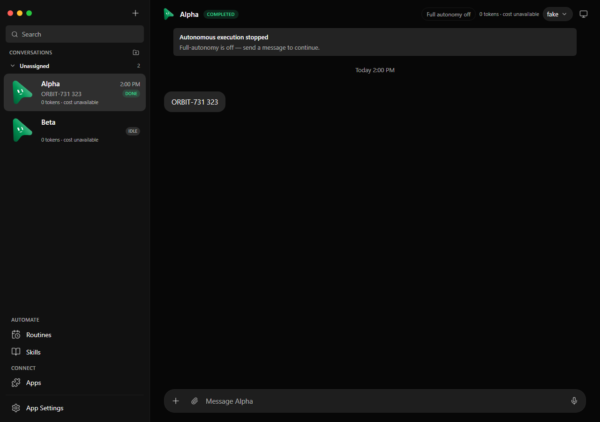
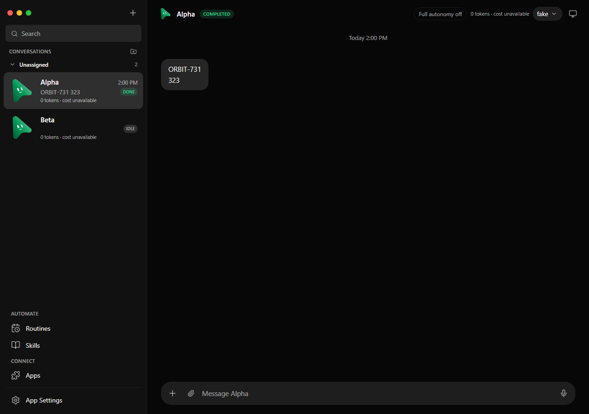
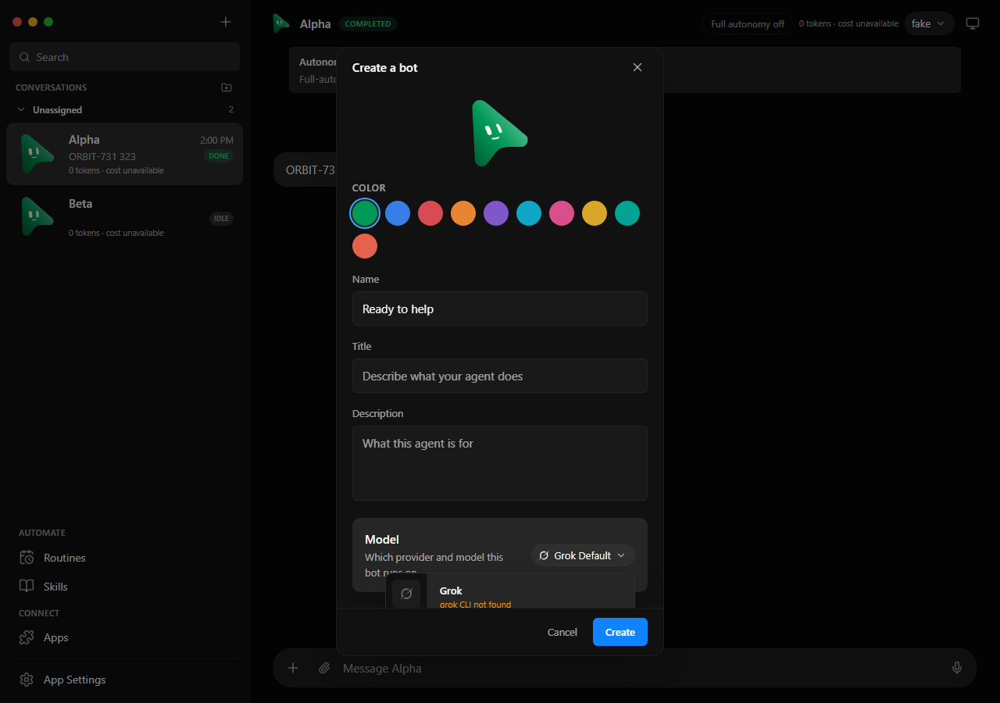
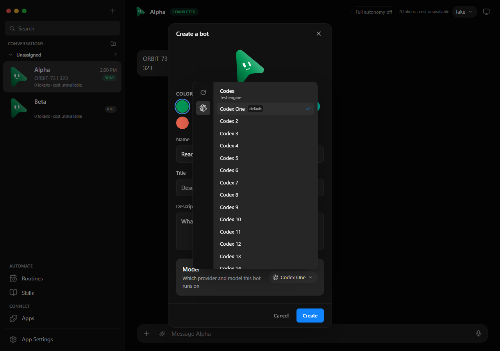

# Live-test reliability fixes

These changes address the Windows 0.4.4 live-test findings using the existing Codex driver and desktop UI.

- Stop settles as an interruption before process termination, saves unfinished streamed text, and waits for process cleanup. Late process output cannot turn cancellation into a crash.
- Cancelled turns remain paused with an idle bot, without a failure notification. Follow-ups require explicit Resume.
- Ordinary turn failures no longer produce engine-installation cards. Successful recovery dismisses stale setup cards and clears stale client error descriptions.
- `update_bot` accepts `bot_id: "self"`, resolved from the calling bot's integration context. Peer discovery still lists other bots.
- New-bot creation prefers the current available model, then an available engine. The model menu uses a viewport-bounded portal with independently scrollable choices and Escape handling.
- Chat paragraphs preserve line breaks. Completed turns no longer show an autonomy-stop banner. Submitting a new message immediately starts a fresh working state and timer.

## Screenshots

These use deterministic fake data and contain no user conversations. The before images use the previously built 0.4.4 desktop client; the after images use the changed client.

| View | Before | After |
| --- | --- | --- |
| Completed reply and line breaks |  |  |
| New-bot model selection |  |  |

## Regression coverage

The Codex adapter tests exercise interruption before handshake and during streaming, repeated Stop, preserved partial text, absence of runtime errors, and a successful subsequent turn. Contract fixtures record interruption rather than process failure for both cancellation and fleet shutdown.

Service tests cover paused cancellation, ordinary failures without installation advice, and successful recovery of existing setup cards. Proxy tests verify self-update targets the calling bot and forwards only requested fields.

The existing Windows packaging-test cleanup now uses bounded retries for temporary directories that can remain briefly locked after the smoke process exits. Assertions and persistent cleanup failures still fail the suite.

The shared test-server harness explicitly hides its Windows console. Broad local test reruns were stopped after visible helper windows disrupted desktop use; those interrupted runs are not passing-suite evidence.

Browser coverage drives a fake Codex process through streaming, queuing, Stop, reload, and Resume, checking persisted partial output and exactly-once follow-up delivery. Additional checks cover unavailable default engines, a long model list in a 900 × 600 viewport, Escape without closing the create form, preserved line breaks, lists and code blocks, and a fresh timer before server acknowledgment.

All harnesses use isolated temporary data and scripted engines. No live provider or installed user app is modified by these tests. This is validation of the source changes, not a new packaged release.
