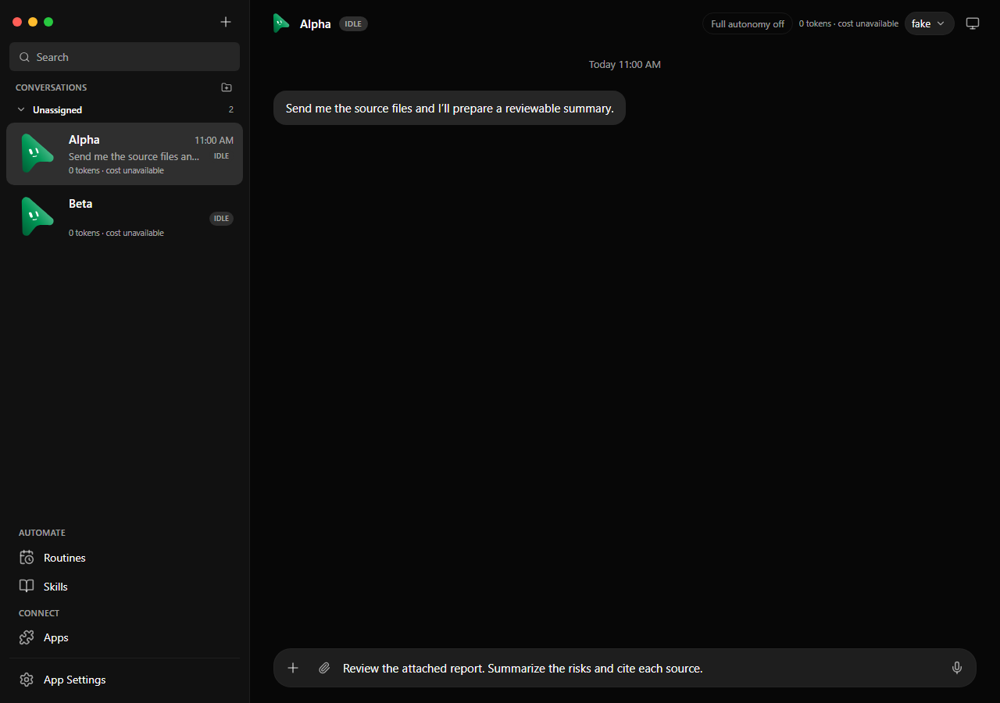
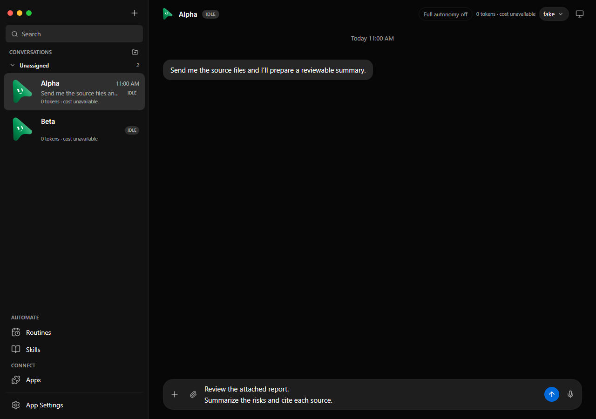

# Daily workflow reliability

This change addresses lost drafts and failed submissions, attachment delivery,
Stop behavior, stale computer previews, long histories, and error recovery.

## Behavior

- Each conversation keeps its text, attachment chips, and mentioned skills when
  switching bots or reloading the renderer. Drafts and pending submissions use
  session storage; this does not promise recovery after quitting the app.
- The composer grows for multiline text. Enter sends, Shift+Enter inserts a
  newline, and IME composition does not send. A visible Send button accompanies
  a nonempty draft.
- Submissions stay in the pending list until acknowledged. Retry reuses the
  message's idempotency key; Edit restores a failed payload into an empty draft.
  Editing a failed head pauses any later prompts so they cannot overtake it.
- Stop pauses local follow-ups. Reloaded pending work requires explicit Resume
  or Retry. Stopping during an in-flight submission also interrupts after its
  acknowledgement to cover late acceptance.
- Electron drag/drop resolves paths through `webUtils.getPathForFile`. Pasted
  PNG, JPEG, and WebP bytes are validated and saved under generated filenames in
  the app's attachments directory. Missing or rejected files produce errors.
  The server rejects unreadable attachments before accepting a message.
- A live screenshot expires after six seconds without another frame. Polling
  then resumes even while the bot is busy, and the newest frame wins. The panel
  shows the last update age and offers refresh.
- Initial snapshots request 50 messages per conversation. Earlier messages load
  in pages of 100, with at most 150 messages rendered. Text deltas notify only
  the relevant conversation and are coalesced to animation frames; settled chat
  bubbles are reused during streaming.
- Bot creation, engine discovery, routine history, and memory-save failures
  expose local errors and retry controls rather than disappearing or reporting
  a successful empty result.

## Review images

These images use the same deterministic fixture, viewport, and multiline draft.

Before:

After:

## Verification boundaries

The Playwright workflow matrix uses the real isolated local harness with
controlled snapshots, event frames, and HTTP failures. The existing fake-engine
smoke additionally exercises real HTTP/SSE turn delivery. Clipboard file writing
and server attachment rejection have unit/integration coverage.

Native OS drag/drop and clipboard integration still need a packaged Electron
check on the release platforms. No production provider credentials or paid
computer sessions are used by these checks. This change adds no dependencies.
